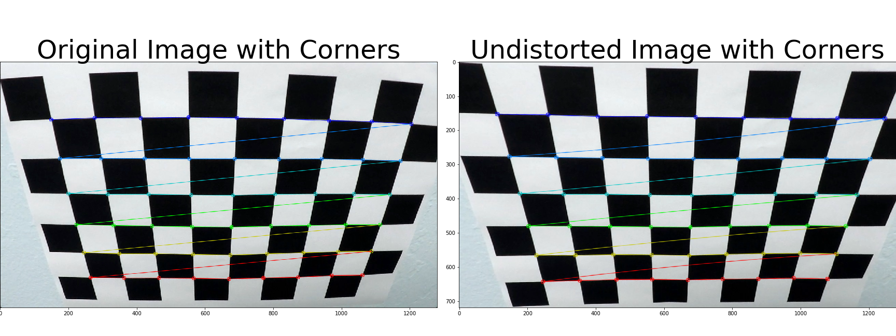
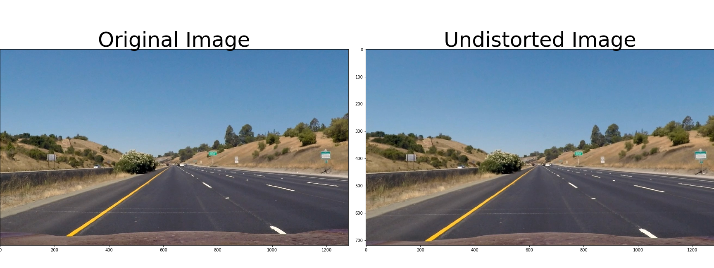
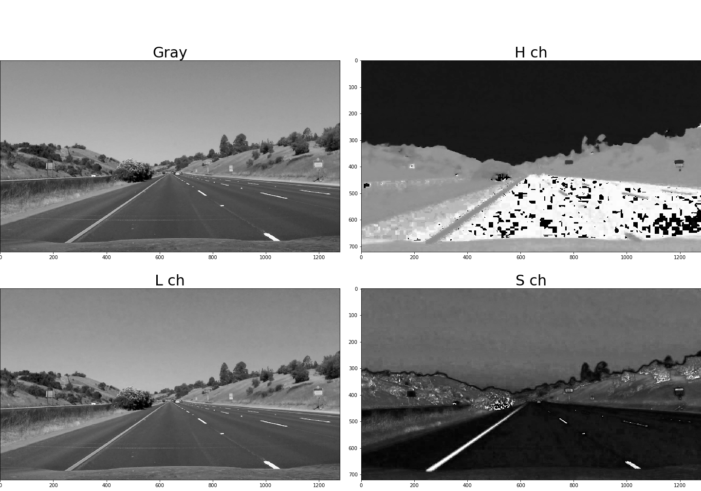
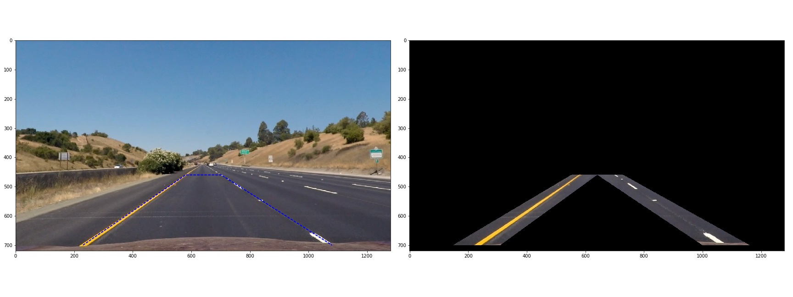
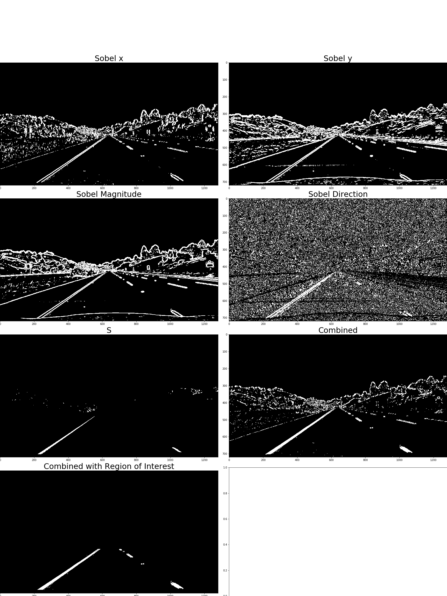
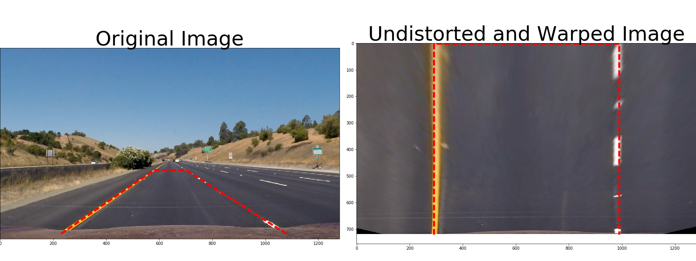
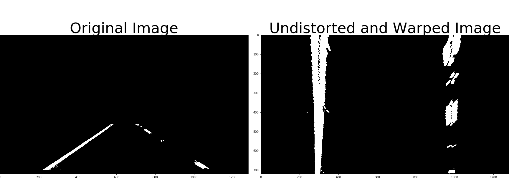
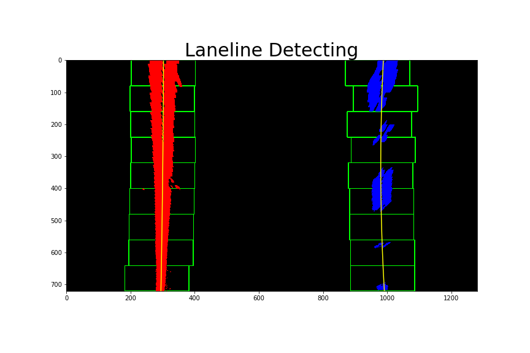
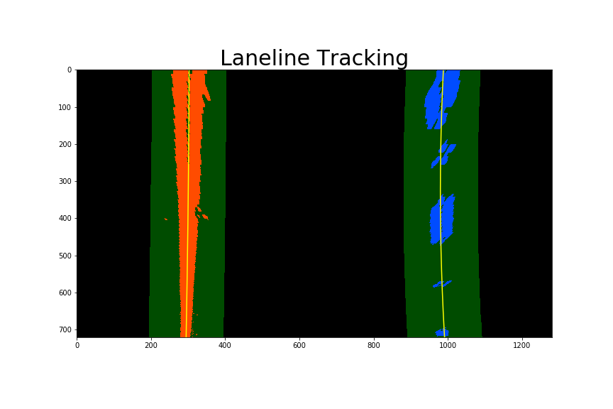
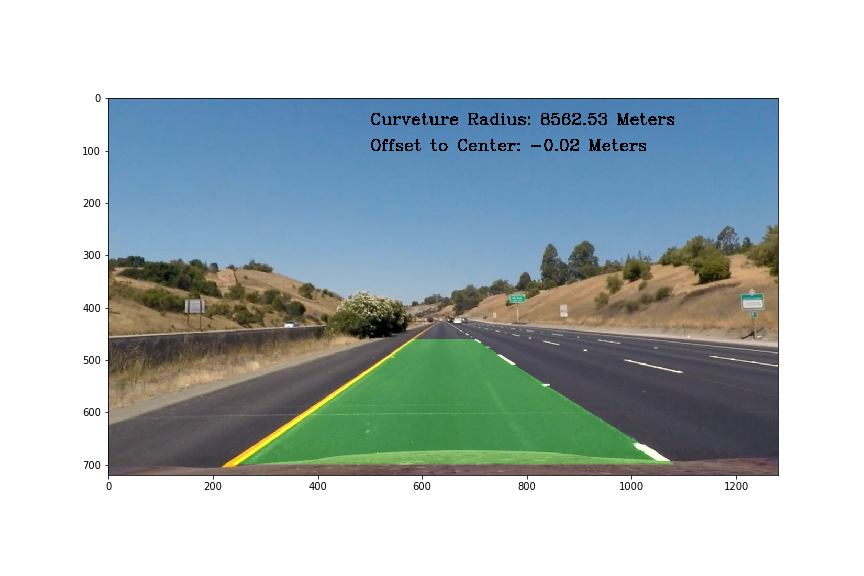

# **Project 4: Advanced Lane Finding**

### Project goal
The goal of this project is to identify lane lines in a video stream captured by front-mounted camera, to calculate the lane curvature and vehicle position from the center of lane. Identified lane boundaries will be back-annotated onto the original image.

### Steps to find lane lines in a single image
To find lane lines in a single image, the following steps are implemented in notebook file `P4_code.ipynb`.

#### 1. Calibrate camera distortion
Camera distortion is calibrated with the chess board images provided in directory `./camera_cal/`. As many calibration images (17 out of 19) as possible are used to improve calibration accuracy. Raw chess board images are converted to Gray scale, before applying function `cv2.findChessboardCorners()` with `nx = 9` and `ny = 6`. Distortion parameters `mtx` and `dist` are save to `./camera_dist_param.p`. Please note that this is one-time calibration, and the parameters will be used for all following images. Figure below shows a raw chess board image with camera distortion and a undistorted image with such calibration.



#### 2. Apply distortion correction to raw image
Camera distortion correction with Function `cv2.calibrateCamera()` has to be applied to every image. The following figure shows an example road image before and after distortion correction



#### 3. Create a thresholded binary image

From the undistorted image, a thresholded binary image is generated to detect edges, by combining sobel x & y, sobel magnitude & direction, and S-channel in HLS color space. The pipeline is defined in function `thresh_pipeline()`, and described in more details below. The input is the undistorted image, and the output is a binary image containing detected edges
* a) Apply Gaussian blurring `cv2.GaussianBlur()` to remove high frequency noise with `kernel_size = 5`
* b) Convert blurred image from RBG space to gray scale with function `cv2.cvtColor()`
* c) Get a thresholded binary image based on sobel x & y, with `thresh_abs = (20, 255)`
* d) Get a thresholded binary image based on sobel magnitude & direction, with `thresh_mag = (30, 255)` and `thresh_dir = (0.6, 1.1)`
* e) Convert blurred image from RBG space to HLS space. For comparison purpose, the following plot shows gray-scale image, H-channel, L-channel, and S-channel. It can be seen that lane lines are the most visible in S-channel.



* f) Get a thresholed binary image based on S-channel, with `thresh_s = (160, 255)`
* g) Combine binary images from c), d), and f), with the following python code
``` python
combined_binary = np.zeros_like(sobelx_binary)
combined_binary[(hls_binary == 1) | (((sobelx_binary == 1) & (sobely_binary == 1)) | ((sobel_mag_binary == 1) & (sobel_dir_binary == 1)))] = 1
```
* h) Define the region of interest mask for lane line search. the following image shows image with (left) and without (right) region mask.



* i) Apply region mask to the combined binary image from g). Table below shows the threshold values used for various binary images.

| Source        | Threshold   |
|:-------------:|:-------------:|
| sobel x      | (20, 255)     |
| sobel y      | (20, 255)     |
| sobel magnitude     | (30, 255)   |
| sobel direction     | (0.6, 1.1)  |
| S-channel     | (160, 255)        |

The following plot shows various thresholded binary images, combined binary images, as well as the final image with region mask applied.



#### 4. Calculate perspective transform parameters
Perspective transform is used to convert the region of interest to 'birds-eye' view or 'top-down' view. The four source points and 4 destination points are defined below.
```python
vertices = np.array([(230, 700), (580, 460), (702, 460), (1080, 700)], dtype=np.int32)
im_xsize = 1280
im_ysize = 720
x_offset = 290 # offset for dst points
y_offset = 0
dst = np.float32([[x_offset, im_ysize-y_offset], [x_offset, y_offset], [im_xsize-x_offset, y_offset], [im_xsize-x_offset, im_ysize-y_offset]])
```
This resulted in the following source and destination points:

| Source        | Destination   |
|:-------------:|:-------------:|
| 230, 700      | 290, 720      |
| 580, 460      | 290, 0        |
| 702, 460      | 990, 0        |
| 1080, 700     | 990, 720      |

Transform matrix is calculated with function `cv2.getPerspectiveTransform()`, as below.

```python
M = cv2.getPerspectiveTransform(src, dst)
invM = cv2.getPerspectiveTransform(dst, src)
```
`M` represents the transform matrix from original perspective to top-down perspective, and `invM` represents the inverse transform from top-down back to original perspective. Both matrixes are save to file `camera_warp_param.p` for future usage. The following plot shows original image and warped image (top-down) after perspective transform, as well as source and destination region in red dashed lines.



#### 5. Apply perspective transform to binary image

Perspective transform with matrix `M` is applied to every binary image from step 3, with function `cv2.warpPerspective()`, as below.
```python
image_warped = cv2.warpPerspective(image_thresh, M, image_thresh.shape[1::-1], flags=cv2.INTER_LINEAR)
```
The original binary and warped image are shown below



#### 6. Detect lane pixels and fit lane line curves
Based on the undistorted and warped binary image, lane line pixels are detected. If without any pre-knowledge of lane lines, I use the histogram method provided in Udacity class to search lane pixels in the image. There are 9 windows in total vertically, and each window is +/-100 pixels wide horizontally. After pixels are determined, a second order polynomial fitting is applied to find the best curve fitting these pixels, as below.

```python
lane_fit = np.polyfit(lane_y, lane_x, 2)
```

The following image shows detected pixels for left and right lane lines, as well as the fitted curves.



If pre-knowledge of lane lines are available, I am using such information to directly determine lane pixels. This could give more smooth and fast processing. The following figure shows lane pixels detection and lane line fitting under such scenario.



#### 7. Calculate lane curvature and vehicle position
Based on the fitted lane curve, lane curvature and vehicle positon from lane center are calculated, with the method provide in class, as below.
```python
ym_per_pix = 30/720
xm_per_pix = 3.7/700
y_eval = 720
lane_curverad = ((1 + (2*lane_fit_cir[0]*y_eval*ym_per_pix + lane_fit_cir[1])**2)**1.5) / np.absolute(2*lane_fit_cir[0])
lane_offset = lane_fit_cir[0]*(y_eval*ym_per_pix)**2 + lane_fit_cir[1]*(y_eval*ym_per_pix) + lane_fit_cir[2]
```
#### 8. Warp the detected lane boundaries back
With both lane lines are identified, the lane region is filled with light green, and is further transformed from top-down view to original perspective with matrix `invM`, as below.
```python
newwarp = cv2.warpPerspective(color_warp, invM, (image.shape[1], image.shape[0]))
```
#### 9. Display lane boundaries and curvature/position
Finally, the lane boundaries image is added on top of original image, and calculated lane curvature and vehicle positon from lane center are printed on top of that, as well. The following figure shows an example.



Now, the processing to identify lane lines for a single image is completed.

### Processing over video stream frames

In a video stream, the lane line in one frame will not change dramatically from that in the previous frame or several previous frames. If vary large change on lane line parameters, such as polynomial fitting coefficients or calculated curvature, it is very likely that something went wrong in lane line detection. So a sanity check is applied on the detection results, before it goes to final. Also, a smoothing function is applied to the final results, to reduce the impact of estimation error in a single frame. A `Line()` class is defined to record and track all the detection results, as below.
```python
class Line():
    def __init__(self):
        self.detected = 0 # Lane line already detected or not
        self.frame_cnt = 0 # total frames processed
        self.all_fit = [] # record all fitting coefficients for all frames
        self.all_fit_cir = [] # record all fitting coefficient for all frames
        self.all_curverad = [] # record curvature for all frames
        self.all_offset = [] # record offset from center for all frames
        self.current_fit = [] # current lane fitting coefficients
        self.current_fit_cir = [] # current lane fitting coefficients
        self.current_curverad = [] # current curvature
        self.current_offset = [] # current offset from lane center
        self.mis_frame = 0 # missed frames in a row
```
Here more details are discussed. These features are implemented in function `lane_fit_update()`.

#### 1. Sanity check on every single frame
The following criterion is applied:
* a) There must be sufficient amount of pixels in the lane region (>10)
* b) The difference between fitting coefficients in the next frame and those currently used must be small enough (<0.005 for second-order coefficient)
* c) The calculated curvature must be a realistic number (>300 meters for highway in the sample video)
* d) The vehicle position calculated in the next frame should have small change from current position (<50 image pixels)

Violation on any of these four will label the next frame as a missing/invalid frame, and the estimation results are discarded. And current lane line will remain to the next frame.
#### 2. Smoothing over frames
If the lane detection on the next frame is valid, the estimation results will be taken into account by a smoothing function or alpha filtering, to update the current/active estimation, such as fitting coefficients, curvature and offset, as bellow.
```python
alpha = 0.9
lane_line.current_fit = alpha * lane_line.current_fit + (1-alpha) * frame_fit
```
#### 3. Missing frames treatment
As discussed before, two lane pixels detection methods, histogram search without pre-knowledge (`line.detected == 0`) and lane region search with pre-knowledge (`line.detected == 1`), are used. At the very beginning, I defined `line.detected == 0` and start histogram search from scratch. After a frame with valid lane detection is processed, I set `line.detected == 1`. When there are more than *five* missing frames happening in a row, I will reset `line.detected == 0` to start new search, since the recorded lane lines are probably not holding any more.

Here's a [link to my video result](./project_video_output.mp4).

### Discussion

It takes me lots of time and effort to put everything together for this project, particularly on tuning the threshold values and processing sanity check and smoothing on video stream. The pipeline works quite well on `project_video.mp4`, and it recognizes the lane region through the video with smooth transitions. However, it doesn't work well on `challange_video.mp4`, mostly due to the changing shadow and sunlight, which gives me a hard time for edge detection. 
